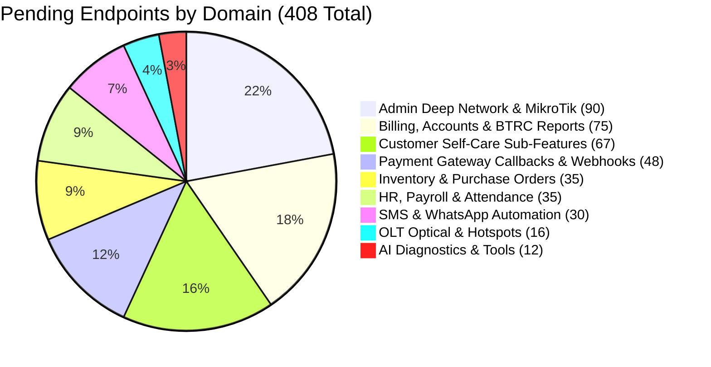

# 02. Pending & Incomplete API Roadmap (408 Endpoints)

> Comprehensive directory of all remaining **408 endpoints** in the backend catalog that are queued to replace local mock data (`src/lib/mock-api/`) in the frontend UI.

---

## 1. Domain Breakdown of Pending Endpoints

---

## 2. Incomplete Modules & Screen Mapping

### 2.1 Deep MikroTik Controls & Network (`/admin/network/*`, `/admin/bandwidth`)
- **Current State:** Screens render UI with mock interface lists and static graph charts.
- **Backend Endpoints Ready:**
  - `GET /api/v1/reseller/routers/{id}/traffic` (Live Rx/Tx stream)
  - `GET /api/v1/reseller/routers/{id}/sessions` (Active PPPoE connections)
  - `POST /api/v1/reseller/routers/{id}/disconnect` (Kill active session)
  - `GET /api/v1/reseller/routers/{id}/dhcp-leases` (DHCP leases table)
  - `GET /api/v1/reseller/routers/{id}/queues` (Bandwidth throttles)
- **Frontend Target:** Replace `mockFetch('network.routers')` in `src/features/admin/network/`.

### 2.2 Invoicing & Telecom Compliance Reports (`/admin/reports/*`, `/admin/invoices/*`)
- **Current State:** Static tables for BTRC and monthly billing summaries.
- **Backend Endpoints Ready:**
  - `GET /api/v1/reseller/reports/btrc/{id}` (BTRC user statistics)
  - `GET /api/v1/reseller/reports/revenue/{id}` (Monthly cash collection trends)
  - `GET /api/v1/reseller/invoices/{id}` (Invoice details and PDF format)
  - `GET /api/v1/reseller/corporate/{id}/invoices` (Corporate enterprise billing)
- **Frontend Target:** Replace mock tables in `src/features/admin/reports/`.

### 2.3 Inventory Management & Supplier Purchase (`/admin/inventory/*`, `/admin/purchase/*`)
- **Current State:** Mock list of fiber patch cords, routers, and ONUs.
- **Backend Endpoints Ready:**
  - `GET/POST /api/v1/reseller/inventory/{id}` (Stock quantity & alerts)
  - `GET/POST /api/v1/reseller/purchase/{id}` (Vendor purchase orders)
- **Frontend Target:** Replace mock data in `src/features/admin/inventory/`.

### 2.4 OLT & Hotspot Voucher Engine (`/admin/olt/*`, `/admin/hotspot/*`)
- **Current State:** Mock display of PON ports and voucher generation modal.
- **Backend Endpoints Ready:**
  - `GET /api/v1/reseller/olt/{id}` (OLT devices list)
  - `GET /api/v1/reseller/olt/{id}/optical-power` (dBm signal telemetry)
  - `GET /api/v1/reseller/hotspot/{id}` (Hotspot server status)
  - `POST /api/v1/reseller/hotspot/vouchers/{id}/batch` (Batch voucher generation)
- **Frontend Target:** Replace mock data in `src/features/admin/olt/` and `src/features/admin/hotspot/`.

### 2.5 Field Staff Attendance & GPS Punch (`/admin/hr/*`, `/employee/attendance`)
- **Current State:** Mock attendance calendars and punch buttons.
- **Backend Endpoints Ready:**
  - `POST /api/v1/reseller/employees/{id}/attendance/check-in`
  - `POST /api/v1/reseller/employees/{id}/attendance/check-out`
  - `POST /api/v1/reseller/employees/{id}/attendance/location`
- **Frontend Target:** Replace mock hooks in `src/features/employee/attendance/`.

### 2.6 SMS Templates & WhatsApp Automated Bots (`/admin/sms-templates`, `/admin/whatsapp`)
- **Current State:** Mock template editor and mock QR code modal.
- **Backend Endpoints Ready:**
  - `GET/POST /api/v1/reseller/sms/{id}/templates`
  - `GET/POST /api/v1/reseller/whatsapp/{id}/templates`
  - `GET /api/v1/reseller/whatsapp/settings/{id}`
- **Frontend Target:** Replace mock templates in `src/features/admin/whatsapp/`.
