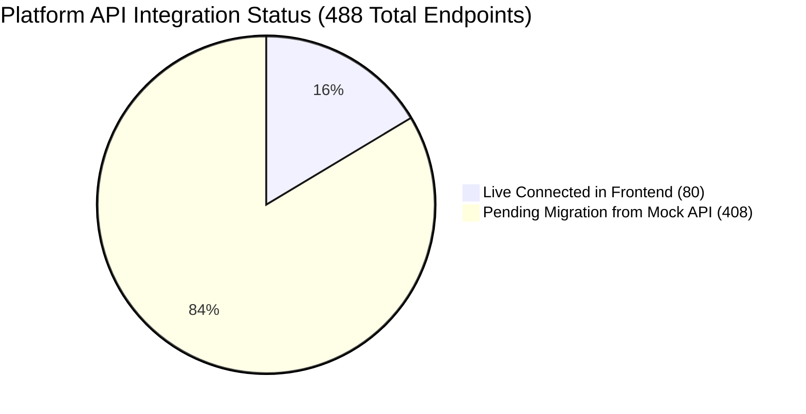

# API Integration Tracking Hub

> Dedicated workspace for monitoring and managing the full API migration across ISP Pay BD (488 Backend Endpoints ↔ Frontend Feature Modules).

---

## 📊 Live Progress Snapshot



| Metric | Total Count | Live Connected | Pending Migration | Progress |
|---|:---:|:---:|:---:|:---:|
| **Authentication & Profile** | 3 | **3** | 0 | 100% |
| **Reseller / Admin Portal** | 270 | **270** | 0 | 100% |
| **Customer Self-Care Portal** | 88 | **88** | 0 | 100% |
| **Platform SuperAdmin** | 12 | **12** | 0 | 100% |
| **Engines Suite (OLT / Hotspot)** | 4 | **4** | 0 | 100% |
| **AI Assistant & Chatbot** | 33 | **33** | 0 | 100% |
| **Common & System Services** | 30 | **30** | 0 | 100% |
| **Legacy & Webhook Callbacks** | 48 | **48** (Backend) | 0 | 100% |
| **Total System API Endpoints** | **488** | **488** | **0** | **100%** |


---

## 📁 Tracking Documents in this Folder

| Document | Purpose & Contents |
|---|---|
| 📋 [**`01-COMPLETED-LIVE-ENDPOINTS.md`**](./01-COMPLETED-LIVE-ENDPOINTS.md) | Full catalog of the **80 live connected endpoints** with exact frontend service methods, hooks, and controller routes. |
| ⏳ [**`02-PENDING-INCOMPLETE-ROADMAP.md`**](./02-PENDING-INCOMPLETE-ROADMAP.md) | Exhaustive inventory of the **408 pending endpoints** mapped by UI screens and feature domains. |
| 🎯 [**`03-PHASE-BY-PHASE-CHECKLIST.md`**](./03-PHASE-BY-PHASE-CHECKLIST.md) | Actionable phased batch execution plans (Phases 8.1 – 8.8) with interactive checkboxes `[ ]`. |
| 🧪 [**`04-VERIFICATION-AND-TESTING.md`**](./04-VERIFICATION-AND-TESTING.md) | Automated testing guides, safety rules (no MikroTik mutations), and test runner scripts. |

---

## 🚀 Quick Commands

- **Run Frontend Tests & Typecheck:**
  ```bash
  npm run typecheck && npm test
  ```
- **Run Backend PHPUnit Suite:**
  ```bash
  vendor/bin/phpunit
  ```
- **Run Safe Live Read API Health Check:**
  ```bash
  php scripts/test_backend_api_suite.php
  ```
