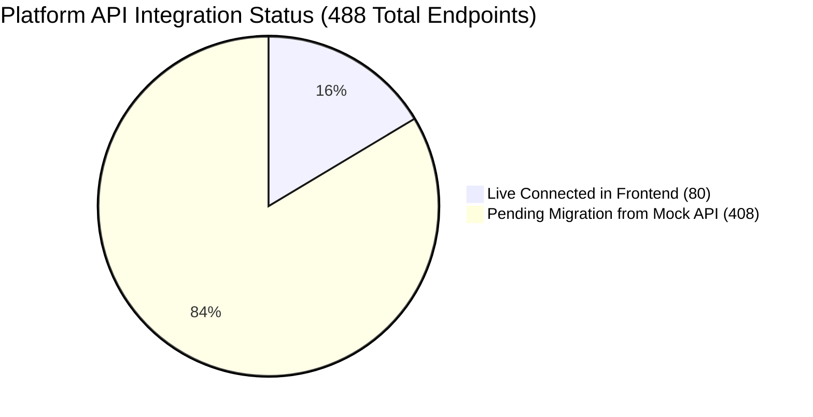

# ISP Pay BD — API Integration Status & Progress Tracker

> Synchronized master tracker: mapping **488 registered backend endpoints**, **80 live frontend service methods**, and **phased migration checklists** across the ISP Pay BD platform.

---

## 1. Status Overview

| Metric | Total Count | Live Connected | Pending Migration |
|---|:---:|:---:|:---:|
| **Authentication & Profile** | 3 | **3** (100%) | 0 |
| **Reseller / Admin Portal** | 270 | **33** (12.2%) | 237 |
| **Customer Self-Care Portal** | 88 | **21** (23.8%) | 67 |
| **Platform SuperAdmin** | 12 | **10** (83.3%) | 2 |
| **Engines Suite (OLT / Hotspot)** | 4 | **2** (50.0%) | 2 |
| **AI Assistant & Chatbot** | 33 | **2** (6.0%) | 31 |
| **Common & System Services** | 30 | **9** (30.0%) | 21 |
| **Legacy & Webhook Callbacks** | 48 | **0** (Backend Only) | 48 |
| **Total Registered System APIs** | **488** | **80** (16.4%) | **408** |

---

## 2. Live Completed Modules Checklist

- [x] **Authentication**: Login, Token Refresh, Current User Profile (`/me`).
- [x] **Admin Dashboard**: Live collections, subscribers, bandwidth metrics, active routers.
- [x] **Customers**: List, Search, Detail, Create, Edit, Soft-delete, Bulk Recharge, PPPoE Sync, MAC Binding.
- [x] **Service Areas**: Area and Sub-area CRUD.
- [x] **Packages & Tariffs**: Bandwidth packages CRUD and tariff limits.
- [x] **Payments & Collections**: Customer payment collections, funding ledger, payment histories.
- [x] **Staff & HR**: Employee directory, salary payouts, advance salary records.
- [x] **Helpdesk**: Support ticket listing, thread chat, staff assignment.
- [x] **SMS Marketing**: Message history logs, recipient broadcasting.
- [x] **Accounting**: Balance Sheet, Chart of Accounts, Journal Entries, Transactions.
- [x] **Routers & IP Pools**: MikroTik routers list and IP pool subnets.
- [x] **Rewards & Loyalty**: Customer reward wallets, points report, referral links.
- [x] **Customer Self-Care**: Customer dashboard, plan renewal, tickets, WiFi control, speed diagnostics, connected devices.
- [x] **Platform SuperAdmin**: SaaS stats, reseller tenant onboarding, engine catalog, system health.

---

## 3. Pending Migration Phases Checklist (Phases 8.1 – 8.8)

### Phase 8.1: Network, MikroTik Deep Controls & Bandwidth Graphs
- [ ] **Bandwidth Live Graph**: Wire `/admin/bandwidth` to `/api/v1/reseller/routers/{id}/traffic`
- [ ] **Active PPPoE Sessions**: Wire `/admin/network/sessions` to `/api/v1/reseller/routers/{id}/sessions`
- [ ] **Session Disconnect Action**: Wire Disconnect button to `POST /api/v1/reseller/routers/{id}/disconnect`
- [ ] **DHCP Leases Table**: Wire `/admin/network/dhcp` to `/api/v1/reseller/routers/{id}/dhcp-leases`
- [ ] **Firewall & Simple Queues**: Wire `/admin/network/queues` to `/api/v1/reseller/routers/{id}/queues`

### Phase 8.2: Invoices PDF, Billing Automation & BTRC Reports
- [ ] **Invoice PDF Viewer / Print**: Wire `/admin/invoices/{id}` to `/api/v1/reseller/invoices/{id}/pdf`
- [ ] **BTRC Telecom Compliance Report**: Wire `/admin/reports/btrc` to `/api/v1/reseller/reports/btrc/{id}`
- [ ] **Revenue Breakdown Report**: Wire `/admin/reports/revenue` to `/api/v1/reseller/reports/revenue/{id}`
- [ ] **Corporate Billing Invoices**: Wire `/admin/corporate/invoices` to `/api/v1/reseller/corporate/{id}/invoices`
- [ ] **Bank Reconciliation**: Wire `/admin/accounting/reconciliation` to `/api/v1/reseller/accounting/{id}/reconciliation`

### Phase 8.3: Inventory Management & Asset Tracking
- [ ] **Inventory Items Stock**: Wire `/admin/inventory/items` to `/api/v1/reseller/inventory/{id}`
- [ ] **Purchase Orders & Supplier Invoices**: Wire `/admin/purchase` to `/api/v1/reseller/purchase/{id}`
- [ ] **Stock Transfers & Dispatch**: Wire `/admin/inventory/transfers` to `/api/v1/reseller/inventory/{id}/transfers`

### Phase 8.4: OLT Optical Power (PON) & Hotspot Voucher Suite
- [ ] **OLT Hardware List**: Wire `/admin/olt` to `/api/v1/reseller/olt/{id}`
- [ ] **PON Port & ONU Signal (dBm)**: Wire `/admin/olt/{id}/ports` to `/api/v1/reseller/olt/{id}/optical-power`
- [ ] **Hotspot Server Config**: Wire `/admin/hotspot` to `/api/v1/reseller/hotspot/{id}`
- [ ] **Hotspot Voucher Batch Generator**: Wire `/admin/hotspot/vouchers` to `POST /api/v1/reseller/hotspot/vouchers/{id}/batch`
- [ ] **Voucher Print Sheet**: Wire `/admin/hotspot/vouchers/print` to `/api/v1/reseller/hotspot/vouchers/{id}/print`

### Phase 8.5: Staff Attendance Check-In & Payroll
- [ ] **Employee Punch In / Out (GPS)**: Wire `/employee/attendance` to `POST /api/v1/reseller/employees/{id}/attendance/check-in`
- [ ] **Monthly Salary Sheet Generator**: Wire `/admin/hr/payroll` to `/api/v1/reseller/employee-payments/{id}/salary-summary`
- [ ] **Leave Application & Approval**: Wire `/admin/hr/leaves` to `/api/v1/reseller/employees/{id}/leaves`

### Phase 8.6: SMS, Voice OTP & WhatsApp Business Automation
- [ ] **SMS Template Variables Builder**: Wire `/admin/sms-templates` to `/api/v1/reseller/sms/{id}/templates`
- [ ] **Voice OTP Broadcast Dispatcher**: Wire `/admin/voice-sms` to `POST /api/v1/reseller/voice-sms/{id}/broadcast`
- [ ] **WhatsApp Bot Configuration & Session**: Wire `/admin/whatsapp` to `/api/v1/reseller/whatsapp/settings/{id}`
- [ ] **WhatsApp Auto-Templates**: Wire `/admin/whatsapp/templates` to `/api/v1/reseller/whatsapp/{id}/templates`

### Phase 8.7: AI Chatbot Assistant & Diagnostics
- [ ] **Live AI Assistant Chat Panel**: Wire `/admin/ai-chat` to `POST /api/v1/ai/query`
- [ ] **Automated Customer Triage**: Wire `/admin/ai-chat/leads` to `GET/POST /api/internal/ai/leads`
- [ ] **AI Router Fault Analyzer**: Wire `/admin/ai-chat/diagnose` to `/api/internal/ai/diagnose`

### Phase 8.8: Extra Modern Modules
- [ ] **Field Work Orders (`isp-ops`)**: Connect to `GET/POST /api/v1/reseller/work-orders`
- [ ] **Recycle Bin Restore**: Connect to `GET/POST /api/v1/reseller/trash/...`
- [ ] **POP Wholesale Packages**: Connect to `GET/POST /api/v1/reseller/pop-packages`
- [ ] **Hardware Store Product Showcase**: Connect to `/api/v1/customer/store/products`
